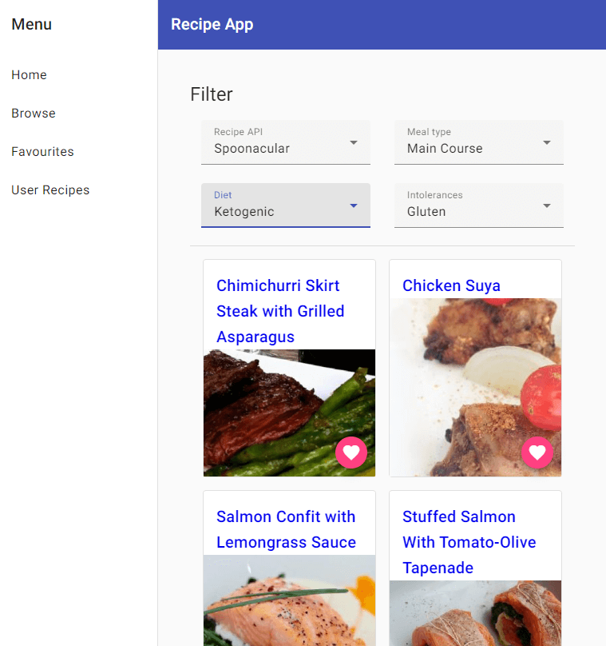
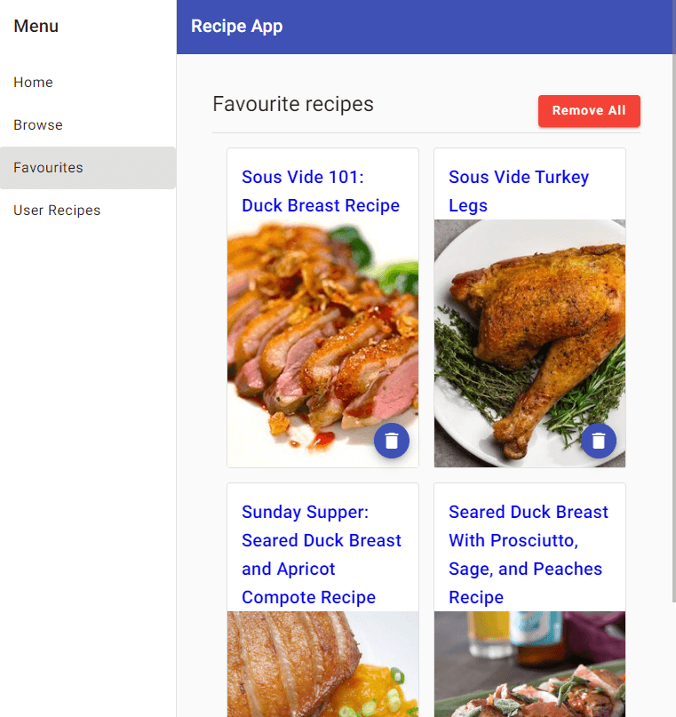
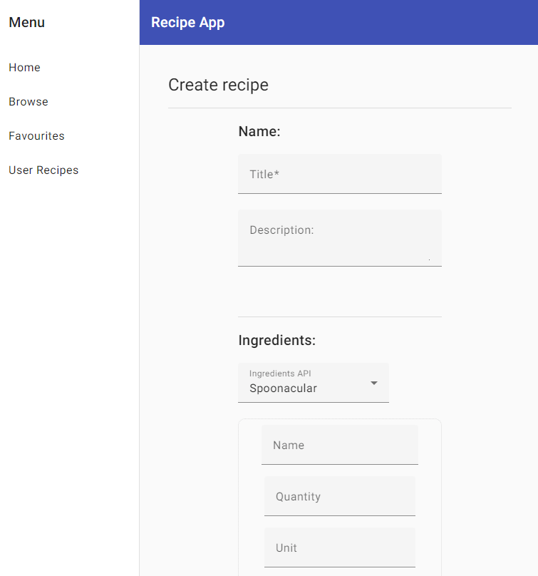

# Angular Recipe Application  [](https://app.netlify.com/sites/angular-recipes-application/deploys)

## Table of Contents

1. [Overview](#overview)
2. [Features](#features)
3. [Description](#description)
4. [Screenshots](#screenshots)
5. [Installation](#installation)
6. [Usage](#usage)
7. [Configuration](#configuration)
8. [Testing](#testing)
9. [Deployment](#deployment)
10. [Launch](#launch)
11. [Acknowledgments](#acknowledgments)

## Overview

Search for recipes by browsing different food categories. Save your favourite recipes, or create your own recipes and organize them in a list.

## Features

- Present recipes from an recipe API in a list to browse through.
- Filter the recipes from an API using different categories for meal types and allergenes.
- Display more information about a recipe with a specific route for that recipe.
- Save/delete a recipe to/from a favourites list.
- Recipe creation and editing.
  - Ingredient autocomplete search utilizing recipe API.
  - Display created recipes in a list.
- Responsive to different displays eg. mobile.
- Possibility to search information from two different recipe APIs, and adding more APIs in the future.

## Description


This recipe app is an easy way for users who need to get ideas and tips for what to eat in minimum amount of time, and without many prerequisites for what to search for. The project started with the simple idea to let users browse for recipes from a recipe API and collect them in one list.

When starting this project I wanted to further my knowledge of Angular and how to connect it to an external API. Create an easy to use web app to clearly display the request data, and allow for users to organize a list of favourite recipes. To extend the available recipes to search for, I added the possibility to seamlessly switch to another API, and the possiblity to add more APIs in the future. If the user would like to add their own recipes to a list, there's a possibility to create a recipe with instructions and ingredients from an API.

## Screenshots

<div align="center" style="display: flex; justify-content: center; align-items: center; width: 100%">
  
  
  
</div>

## Installation

### Dependencies

- [Node.js](https://nodejs.org/) (version 18.19 or higher)
- [Angular CLI](https://angular.dev/tools/cli) (version 18 or higher)

### Steps

1. Clone/download repository.

```bash
  git clone https://github.com/your-username/angular-recipe-application.git
```

2. Navigate to the project directory:

```bash
cd angular-recipe-application
```

3. Install dependencies:

```bash
npm install
```

## Usage

1. Start the development server:

```bash
ng serve
```

or

```bash
npm start
```

2. Open your browser and navigate to http://localhost:4200/.

## Configuration

Set the necessary environment variables with your own API keys. Create a .env file in the root directory. See template in .env.example file for required variables.

```bash
API_KEY=your_api_key_here
```

## Testing

### Running Unit Tests

```bash
ng test
```

### Running End-to-End Tests

```bash
ng e2e
```

## Deployment

### Build for Production

```bash
ng build
```

The build artifacts will be stored in the dist/ directory. You can then deploy the contents of this directory to a web server.

## Launch

[Angular Recipe Application](https://angular-recipes-application.netlify.app)

## Acknowledgments

- [Spoonacular](https://spoonacular.com/food-api)
- [Edamam](https://www.edamam.com/)
